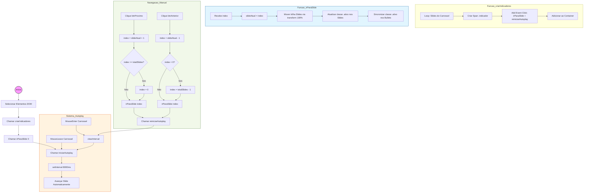

```mermaid
graph TD
    %% Inicialização
    Start((Início)) --> Init[Selecionar Elementos DOM]
    Init --> CriarInd[Chamar criarIndicadores]
    CriarInd --> IrSlide0[Chamar irParaSlide 0]
    IrSlide0 --> StartAuto[Chamar iniciarAutoplay]

    %% Função criarIndicadores
    subgraph Funcao_criarIndicadores
        CriarInd_In[Loop: Slides do Carrossel] --> CriarSpan[Criar Span .indicador]
        CriarSpan --> AddClickInd[Add Event Click: irParaSlide + reiniciarAutoplay]
        AddClickInd --> AppendInd[Adicionar ao Container]
    end

    %% Função irParaSlide
    subgraph Funcao_irParaSlide
        IrSlide_In[Recebe index] --> SetSlideAtual[slideAtual = index]
        SetSlideAtual --> MoveTrilha[Mover trilha Slides via transform 100%]
        MoveTrilha --> UpdateClass[Atualizar classe .ativo nos Slides]
        UpdateClass --> SyncBullets[Sincronizar classe .ativo nos Bullets]
    end

    %% Interações de Botões
    subgraph Navegacao_Manual
        ClickProx[Clique btnProximo] --> CalcProx[index = slideAtual + 1]
        CalcProx --> LoopProx{index >= totalSlides?}
        LoopProx -- Sim --> Reset0[index = 0]
        LoopProx -- Não --> CallIrProx[irParaSlide index]
        
        ClickAnt[Clique btnAnterior] --> CalcAnt[index = slideAtual - 1]
        CalcAnt --> LoopAnt{index < 0?}
        LoopAnt -- Sim --> ResetLast[index = totalSlides - 1]
        LoopAnt -- Não --> CallIrAnt[irParaSlide index]
        
        Reset0 --> CallIrProx
        ResetLast --> CallIrAnt
        CallIrProx --> ReiniciarAuto[Chamar reiniciarAutoplay]
        CallIrAnt --> ReiniciarAuto
    end

    %% Sistema de Autoplay
    subgraph Sistema_Autoplay
        StartAuto --> SetInterval[setInterval 8000ms]
        SetInterval --> AutoMove[Avançar Slide Automaticamente]
        
        MouseEnter[MouseEnter Carrossel] --> ClearInt[clearInterval]
        MouseLeave[MouseLeave Carrossel] --> StartAuto
        
        ReiniciarAuto --> ClearInt
        ClearInt --> StartAuto
    end

    %% Estilização do Diagrama
    style Start fill:#f9f,stroke:#333,stroke-width:2px
    style Funcao_irParaSlide fill:#e1f5fe,stroke:#01579b
    style Sistema_Autoplay fill:#fff3e0,stroke:#e65100
    style Navegacao_Manual fill:#f1f8e9,stroke:#33691e
```
