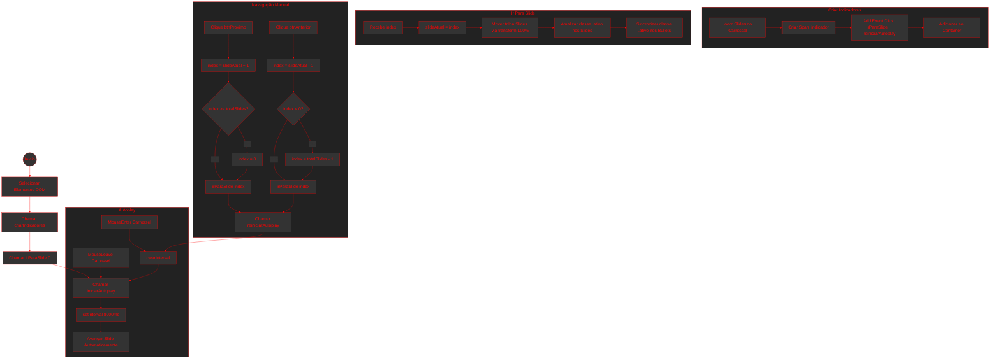

# Diagrama de Fluxo - carrossel.js

Este diagrama descreve a lógica de funcionamento do carrossel com fontes aumentadas para 20px dentro das caixas.

```mermaid
%%{init: {
  'theme': 'base',
  'themeVariables': {
    'fontSize': '20px',
    'mainBkg': '#333',
    'nodeTextColor': '#FF0000',
    'nodeBorder': '#FF0000',
    'lineColor': '#FF0000',
    'labelTextColor': '#FF0000',
    'primaryColor': '#333',
    'clusterBkg': '#222',
    'clusterBorder': '#FF0000',
    'titleColor': '#FF0000',
    'edgeLabelBackground':'#333',
    'fontFamily': 'arial'
  }
}}%%
graph TD
    %% Estilos de classe para garantir o tamanho da fonte em todos os nós
    classDef grande font-size:20px,color:#FF0000,fill:#333,stroke:#FF0000;

    %% Inicialização
    Start((Início)) --> Init[Selecionar Elementos DOM]
    Init --> CriarInd[Chamar criarIndicadores]
    CriarInd --> IrSlide0[Chamar irParaSlide 0]
    IrSlide0 --> StartAuto[Chamar iniciarAutoplay]

    %% Função criarIndicadores
    subgraph Funcao_criarIndicadores [Criar Indicadores]
        CriarInd_In[Loop: Slides do Carrossel] --> CriarSpan[Criar Span .indicador]
        CriarSpan --> AddClickInd[Add Event Click: irParaSlide + reiniciarAutoplay]
        AddClickInd --> AppendInd[Adicionar ao Container]
    end

    %% Função irParaSlide
    subgraph Funcao_irParaSlide [Ir Para Slide]
        IrSlide_In[Recebe index] --> SetSlideAtual[slideAtual = index]
        SetSlideAtual --> MoveTrilha[Mover trilha Slides via transform 100%]
        MoveTrilha --> UpdateClass[Atualizar classe .ativo nos Slides]
        UpdateClass --> SyncBullets[Sincronizar classe .ativo nos Bullets]
    end

    %% Interações de Botões
    subgraph Navegacao_Manual [Navegação Manual]
        ClickProx[Clique btnProximo] --> CalcProx[index = slideAtual + 1]
        CalcProx --> LoopProx{index >= totalSlides?}
        LoopProx -- Sim --> Reset0[index = 0]
        LoopProx -- Não --> CallIrProx[irParaSlide index]
        
        ClickAnt[Clique btnAnterior] --> CalcAnt[index = slideAtual - 1]
        CalcAnt --> LoopAnt{index < 0?}
        LoopAnt -- Sim --> ResetLast[index = totalSlides - 1]
        LoopAnt -- Não --> CallIrAnt[irParaSlide index]
        
        Reset0 --> CallIrProx
        ResetLast --> CallIrAnt
        CallIrProx --> ReiniciarAuto[Chamar reiniciarAutoplay]
        CallIrAnt --> ReiniciarAuto
    end

    %% Sistema de Autoplay
    subgraph Sistema_Autoplay [Autoplay]
        StartAuto --> SetInterval[setInterval 8000ms]
        SetInterval --> AutoMove[Avançar Slide Automaticamente]
        
        MouseEnter[MouseEnter Carrossel] --> ClearInt[clearInterval]
        MouseLeave[MouseLeave Carrossel] --> StartAuto
        
        ReiniciarAuto --> ClearInt
        ClearInt --> StartAuto
    end

    %% Aplicando a classe a todos os nós
    class Start,Init,CriarInd,IrSlide0,StartAuto,CriarInd_In,CriarSpan,AddClickInd,AppendInd,IrSlide_In,SetSlideAtual,MoveTrilha,UpdateClass,SyncBullets,ClickProx,CalcProx,LoopProx,Reset0,CallIrProx,ClickAnt,CalcAnt,LoopAnt,ResetLast,CallIrAnt,ReiniciarAuto,SetInterval,AutoMove,MouseEnter,ClearInt,MouseLeave grande
```
